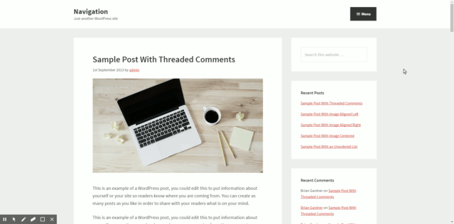

# Genesis Perspective Page View Navigation

* Contributors: craigsimps
* Donate link: https://paypal.me/craigsimps
* Tags: Genesis Framework, Navigation, Off-Canvas Navigation
* License: GPL-2.0
* License URI: https://opensource.org/licenses/GPL-2.0
* Stable tag: 1.0.0

This plugin implements the Perspective Page View Navigation as seen on the [Codrops website](https://tympanus.net/Development/PerspectivePageViewNavigation/index2.html), as a WordPress plugin built for use with the Genesis Framework.



## Installation & Setup

Once the plugin is installed and activated it will: 
* Register a new navigation menu for use by the plugin.
* Output a "Menu" button immediately after the `.title-area` element.

This "Off Canvas Perspective Page Menu" will be displayed when you click the new menu toggle button. It is set to only show 1 level deep (no submenus), and as you will see it should probably hold a maximum of 7 or 8 links. This menu style is not suited to large, content heavy sites where many bavigation links are present.

The menu toggle button is set to output immediately after the `.title-area` element. It has basic styling which places it at the top right of the screen using absolute positioning. This should be overwritten with your own custom CSS.

## Filter Basic Settings

There is a filter in place which allows the following items to be changed:

```php
$config = apply_filters(
    'genesis_perspective_page_view_navigation',
    [
        'icon'   => '<span class="dashicons dashicons-menu"></span>',
        'label'  => __( 'Menu', 'genesis-perspective-page-view-navigation' ),
        'append' => '.title-area',
    ]
);
```

You can override with a filter in your `functions.php` file, for example to change the button label:

```php
add_filter( 'genesis_perspective_page_view_navigation', 'filter_genesis_perspective_page_view_navigation' );
function filter_genesis_perspective_page_view_navigation( $config ) {
    $config['label'] => __( 'Show Menu', 'theme-textdomain' ),
    return $config;
}
```

## Accessibility & Non-JS Issues

While this is a fun way to present your site navigation, it is currently not accessible using the keyboard, and does not have the correct Aria landmarks and labels (although I'm working on that). It also won't function when JavaScript is turned off. So be warned.
